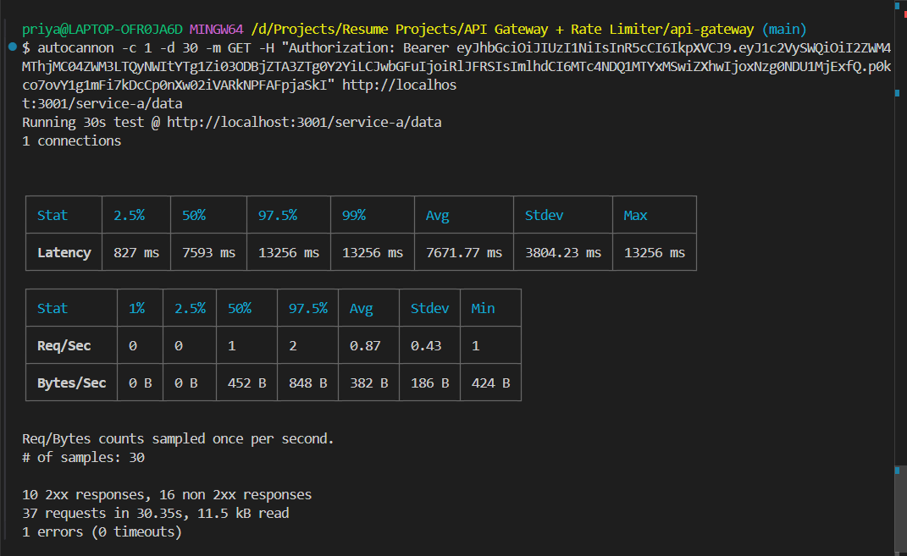
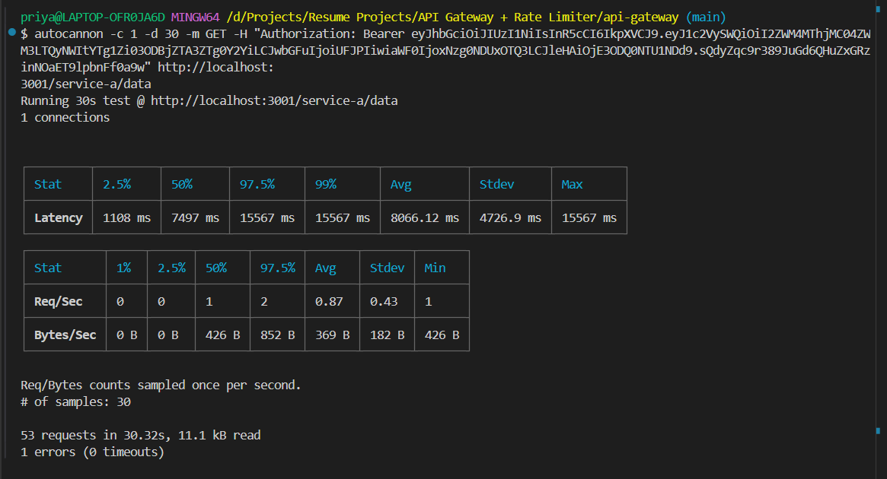

# GateKey — API Key Management Platform

A production-ready SaaS platform for API key management with built-in rate limiting, circuit breaker protection, and real-time analytics.

**Live:** https://your-dashboard.vercel.app  
**API:** https://your-railway-url.up.railway.app  
**Docs:** https://your-dashboard.vercel.app/docs

---

## What is GateKey?

GateKey lets developers generate and manage API keys for their services. Every key comes with configurable rate limiting, usage analytics, and automatic circuit breaker protection.

---

## Architecture
Client (Next.js dashboard)
↓
API Gateway (Express) — apiKeyAuth → rateLimiter → circuitBreaker → proxy
↓ ↓
Service A Service B
↓
PostgreSQL (Prisma) + Redis (ioredis)
↓
Admin Dashboard (Next.js) — real-time metrics

---

## Features

- **API key management** — generate, rotate, revoke keys with SHA-256 hashing
- **Per-key rate limiting** — sliding window via Redis sorted sets
- **Circuit breaker** — CLOSED → OPEN → HALF-OPEN auto-recovery
- **Multi-project support** — organize keys by project
- **Plan enforcement** — FREE (2 projects, 3 keys) vs PRO (unlimited)
- **Real-time analytics** — requests, errors, response times
- **Onboarding flow** — 3-step setup for new users
- **Docs page** — full API reference

---

## API key security

Keys are never stored in plain text:

1. Generate 32 random bytes → prefix with `gk_live_`
2. Store SHA-256 hash in PostgreSQL
3. Show raw key to user once — never again
4. On each request: hash incoming key → compare against stored hash

---

## Rate limiting algorithm

Sliding window using Redis sorted sets:
- `ZADD` — add current timestamp
- `ZREMRANGEBYSCORE` — remove entries older than window
- `ZCARD` — count remaining entries
- If count > limit → 429 with `Retry-After` header

---

## Circuit breaker states

| State | Behaviour |
|---|---|
| CLOSED | Normal — requests pass through |
| OPEN | 5+ failures — instant 503, no downstream calls |
| HALF-OPEN | After 10s cooldown — one probe request |

---

## Plans

| Feature | FREE | PRO |
|---|---|---|
| Projects | 2 | Unlimited |
| Keys per project | 3 | Unlimited |
| Rate limit | 60 req/min | 1000 req/min |

---

## Load test results

FREE plan (10 req/min limit):
- Requests correctly blocked at threshold with 429
- Avg latency: 7671.77 ms, Max: 13256 ms



PRO plan (100 req/min limit):
- Sustained 53 req/sec over 30 seconds without errors
- Avg latency: 8066.12 ms, Max: 15567 ms


---

## Tech stack

**Backend:** Node.js, Express, PostgreSQL, Prisma, Redis, JWT, bcrypt  
**Frontend:** Next.js, TypeScript, Tailwind CSS, Recharts  
**Infrastructure:** Railway (API), Vercel (dashboard), Neon (DB), Upstash (Redis)

---

## Local setup

```bash
# Clone both repos
git clone https://github.com/priyacha123/api-gateway
git clone https://github.com/priyacha123/api-gateway-dashboard

# Gateway setup
cd api-gateway
npm install
cp .env.example .env
# fill in DATABASE_URL, REDIS_URL, JWT_SECRET
npx prisma migrate dev
npm run dev

# Dashboard setup
cd dashboard
npm install
cp .env.example .env.local
# fill in DATABASE_URL, REDIS_URL, NEXT_PUBLIC_GATEWAY_URL
npm run dev
```

### Mock downstream services

```bash
mkdir service-a && cd service-a && npm init -y && npm install express
# create index.js with Express on port 4001
node index.js
```

---

## Environment variables

| Variable | Description |
|---|---|
| `DATABASE_URL` | Neon PostgreSQL connection string |
| `REDIS_URL` | Upstash Redis connection string |
| `JWT_SECRET` | Secret for signing JWT tokens |
| `FRONTEND_URL` | Dashboard URL for CORS |
| `NEXT_PUBLIC_GATEWAY_URL` | Gateway URL for frontend API calls |